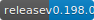

# Confluent CLI

[](https://semaphoreci.com/confluent/cli)

[](https://codecov.io/gh/confluentinc/cli)

## Install

The CLI has pre-built binaries for mac, linux, and windows, on both i386 and x86_64 architectures.

You can download a tarball or a deb package with the binaries. These are both on Github releases and in S3.

Alternatively, you can install from homebrew or using a `curl | bash` one-liner.

The big gotcha right now is that these all require access to the Github repo which isn't open source yet.
So you have to setup ~/.netrc for `curl | bash`, an env var for homebrew, or `~/.aws/credentials` for s3 packages/deb.

Before we GA the CLI, we'll either need to open source the CLI or rework the tooling to be based on a public S3 bucket
instead of Github releases.

**Be sure to setup permissions following the directions for your chosen installation method.**

### Brew

Setup the Confluent Cloud brew tap:

    brew tap confluentinc/ccloud

For now, you'll need to use your Github token:

    HOMEBREW_GITHUB_API_TOKEN=xxx brew install ccloud-cli

The personal access token must have the `repo` permission.

### One Liner

If you don't use a Mac, the simplest way to install is with this one-liner.

Add this to your `~/.netrc`:

    machine api.github.com
            login yourusername
            password yourpassword_or_personalaccesstoken

The personal access token must have the `repo` permission.

Now install the CLI with

    curl -sL https://git.io/vhuDX | bash

It'll install in `./bin` by default. **You MUST add `./bin` to your `$PATH`.**

You can also install to a specific directory. For example, install to `/usr/local/bin` by running:

    curl -sL https://git.io/vhuDX | sudo bash -s -- -b /usr/local/bin

Note: We'll create a nicer short link before we GA the CLI.
(Most link shorteners don't allow you to the change the underlying URL later. So don't claim it before we're ready.)

### Deb Package from S3

If you run Debian/Ubuntu, you can download a deb package from a private S3 bucket.

This requires your Confluent AWS engineering creds setup in your `[default]` AWS profile locally, like normal.

To download the deb for a particular version, run

    VERSION=0.10.0
    OS=Linux
    ARCH=x86_64
    aws s3 cp s3://cloud-confluent-bin/cli/${VERSION}/ccloud-cli_${VERSION}_${OS}_${ARCH}.deb .

To install the CLI:

    sudo apt install ./ccloud-cli_${VERSION}_${OS}_${ARCH}.tar.gz

### Binary Tarball from S3

You can also download a binary tarball from a private S3 bucket.

This requires your Confluent AWS engineering creds setup in your `[default]` AWS profile locally, like normal.

To list all available packages for a version:

    VERSION=0.10.0
    aws s3 ls s3://cloud-confluent-bin/cli/${VERSION}/

To download a tarball for your OS and architecture:

    OS=Darwin
    ARCH=x86_64
    aws s3 cp s3://cloud-confluent-bin/cli/${VERSION}/ccloud-cli_${VERSION}_${OS}_${ARCH}.tar.gz .

To install the CLI:

    tar -xzvf ccloud-cli_${VERSION}_${OS}_${ARCH}.tar.gz
    sudo mv ccloud-cli_${VERSION}_${OS}_${ARCH}/confluent* /usr/local/bin

**Note: You MUST add the plugin binaries to your `$PATH` for the CLI to work.**

## Developing

This requires golang 1.11.

```
$ make deps
$ make build
$ PATH=dist/$(go env GOOS)_$(go env GOARCH):$PATH dist/$(go env GOOS)_$(go env GOARCH)/ccloud -h
```

# Packaging and Distribution

Either set the `GITHUB_TOKEN` environment variable or create `~/.config/goreleaser/github_token`
with this value. The token must have `repo` scope to deploy artifacts to Github.
